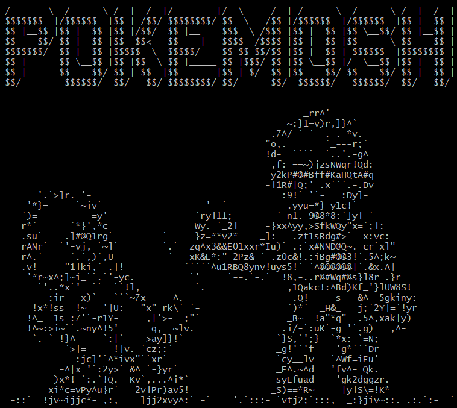

# game-bash-pokemosh
  
  
- Juego en Bash (Shell scripting) de batallas Pokémon en la terminal, diseñado para ejecutarse en la terminal de Linux.
- Menú para que el usuario elija un nombre, seleccione un Pokémon, y se enfrente a contrincantes en batallas.
- El jugador puede elegir entre tres Pokémon iniciales. Cada uno tiene ataques y habilidades específicas.
- Combates por turnos contra oponentes aleatorios.
- Sistema de ataque y defensa basado en variables como vida, armadura, y el daño infligido por cada ataque.
- Almacena los resultados de las batallas en archivos de texto: Ganadores (ganadores.txt) Perdedores (perdedores.txt)
- Archivos de texto (*.txt) para mostrar gráficos ASCII representando ataques, Pokémon, y defensas.
- Dependencia paplay (herramienta de PulseAudio para reproducir sonido).
- Archivos de texto y audio externos para la configuración y efectos.

